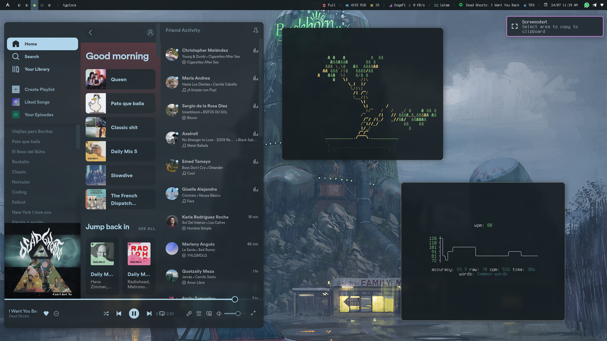

# dotfiles

Here are my dotfiles, for usage in my personal machine

I use arch btw

Color scheme in terminal is a custom one, I like the colors

Software used:

- bspwm
- polybar
- autorandr for multiple randr settings
- zsh
- picom (jonaburg fork)
- nitrogen for wallpaper
- thunar
- rofi
- dunst for notifications
- sxhkd
- alacritty
- maim for screenshots

No install script yet

## Credits

- Color scheme is Everblush: <https://github.com/Everblush>
- Eww dashboard by @AlphaTechnolog: <https://github.com/AlphaTechnolog/eww-dotfiles>
- Rofi menu - Colorful theme by @adi1090x <https://github.com/adi1090x/rofi>
