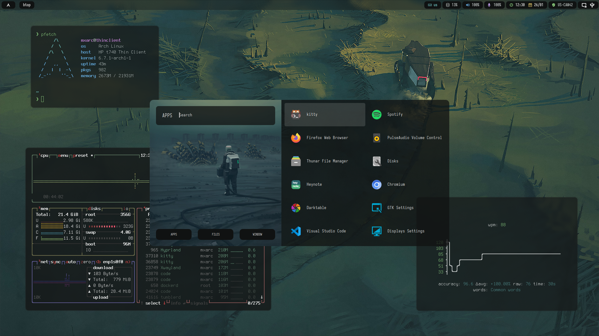

# dotfiles

> 🌟 This is a Wayland setup

Here are my dotfiles, for usage in my personal machine

I use arch btw

Software used:

- hypr [Tiling manager]
- waybar [Top bar]
- zsh [Shell]
- kitty [Terminal emulator]
- waypaper [Wallpapers]
- thunar [File manager]
- rofi [Custom menus]
- dunst [Notifications daemon]
- grimblast [Screenshots]

No install script yet

## Credits

- Color scheme is Everblush: <https://github.com/Everblush>
- Rofi menu - Took some code from @adi1090x <https://github.com/adi1090x/rofi>
